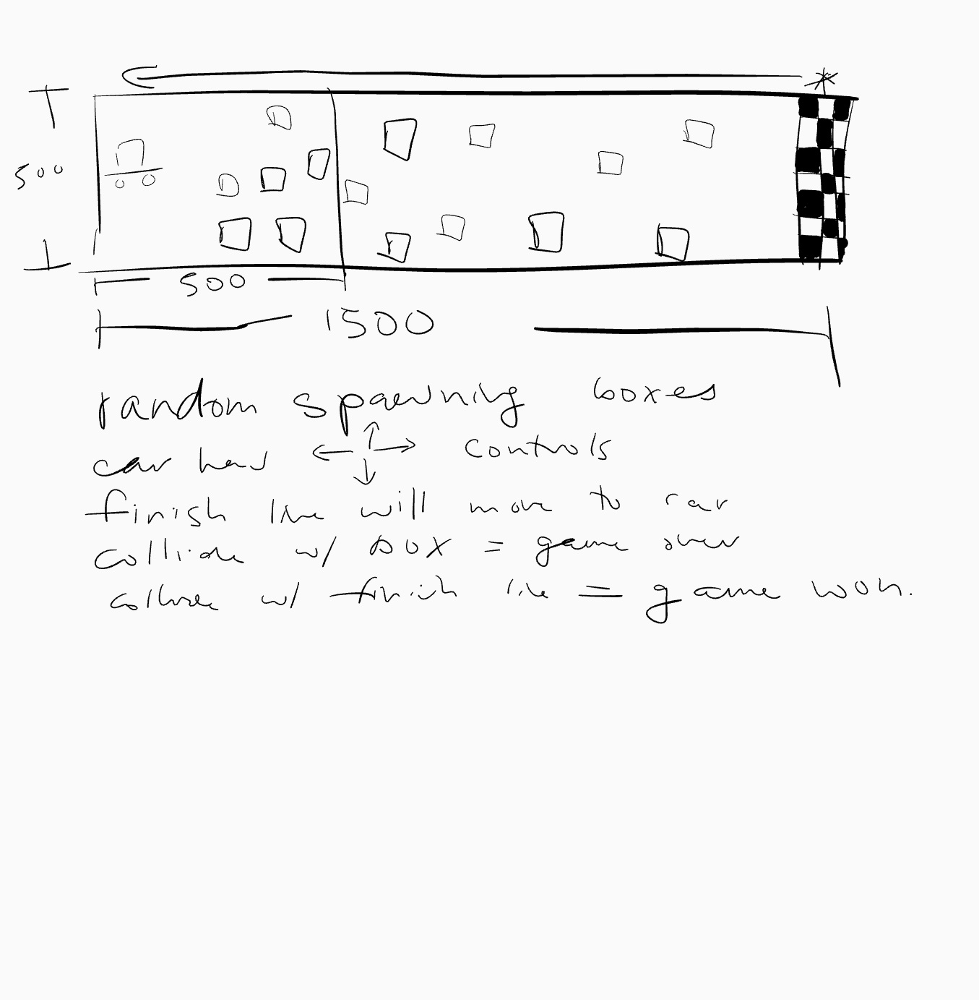

# ICS3U1 Final Project
####Authors:
Dohyun K., Tony D.

##Project Objectives

###Objective of the Game: 
Objective of this game is to drive the car to the finish line and avoid crashing 
into boxes.

###Game Play Instructions: 

You can use the four arrow keys on the bottom left side of the keyboard to control 
the movement of the car. Try to reach the finish line without collision with the 
boxes. 

###Scoring: 
You win if you cross the finish line. If you hit a box, the screen will show you 
game over screen and you lose. 

##Screen Mock-Ups
